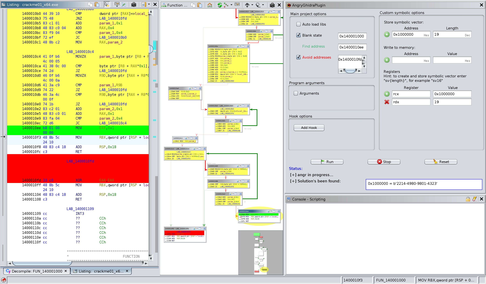

# AngryGhidra

The plugin allows you to use [angr](https://github.com/angr/angr) for binary analysis and symbolic execution in Ghidra interface.

Solving [CTF challenge from SecurityFest 2016 "fairlight"](https://github.com/angr/angr-doc/blob/master/examples/securityfest_fairlight/fairlight) with AngryGhidra plugin:

# Hotkeys

##### Set:
`Z` – **destination** address  
`X` – **start** address  
`J` – **avoid** address (multiple choice)  

##### Reset:
`K` – **destination** address  
`T` – **start** address  
`P` – **avoid** address  

##### Apply bytes:
`U` – apply patched bytes to angr project memory

# Screenshots

Let's keygen:

Apply patched bytes to write them into the memory of angr project:

# Installation

1) `pip3 install angr`
2) Make sure `python3` directory is added to the `PATH` (required, `Python 3` only)
3) Use Gradle to build the plugin: `GHIDRA_INSTALL_DIR=${GHIDRA_HOME} gradle` and use Ghidra to install it: `File → Install Extensions...`
4) Check the box in the "New Plugins Found" window to apply AngryGhidra plugin to your project
5) If "New Plugins Found" window doesn't appear, go to your CodeBrowser project and tick the plugin in `File → Configure →  Miscellaneous → AngryGhidraPlugin`
